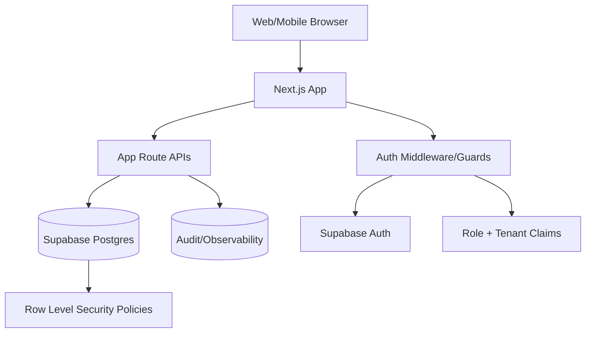

# ZQX Platform System - Architecture Map (ES/EN)

This document captures the current architecture implemented in this repository and a production target architecture.

---

## 1) Architecture Map (Current Implementation)

### 1.1 High-level diagram

```mermaid
flowchart TD
  U[Web/Mobile Browser] --> N[Next.js App Router]
  N --> L[Login UI]
  L --> G[Google OAuth via Supabase]
  L --> P[Password Login API]
  G --> C[/auth/callback]
  C --> M[(In-memory Store)]
  P --> S[(Signed Local Session Cookie)]

  N --> D[/dashboard]
  D --> A[SystemDashboard Client App]
  A --> R[/api/records/*]
  A --> B[/api/chatbot]

  R --> M
  B --> M

  N --> SB[(Supabase Auth Session)]
```

### 1.2 Layers and responsibilities

- Presentation layer: Next.js pages/components (`/login`, `/dashboard`, `/access`).
- API layer: Route handlers for CRUD and assistant intake/chat.
- Auth layer:
  - Supabase OAuth session (Google).
  - Local signed cookie session (`zqx_system_session`) for password fallback.
- Domain layer: tenant + CRM entities (`businesses`, `users`, `clients`, `appointments`, `payments`, etc.).
- Data layer (current): in-memory global store initialized from `seedRecords`.

### 1.3 Where data is stored today

- Business/CRM data is stored in process memory (`globalThis.__zqxSystemStore`) via `lib/core/crud.ts`.
- Initial data comes from `lib/core/seed.ts`.
- Auth identity/session:
  - Supabase cookies/session when OAuth or Supabase email/password is used.
  - Local HMAC-signed session cookie for local password flow.
- Important: CRM records are not persisted to Supabase/Postgres yet; they reset on process restart/redeploy.

### 1.4 Auth and access flow

1. User signs in with Google (Supabase OAuth) or local password.
2. OAuth callback (`/auth/callback`) exchanges code for session and provisions user in `users` entity if missing.
3. Access check (`requireSystemUser`) maps email to internal user record and role/status.
4. If status is `invited`, `disabled`, or `not_found`, user is redirected to `/access`.
5. Active users can access `/dashboard`.

### 1.5 Main entities in the system model

- `businesses`, `users`, `modules`, `business_modules`
- `clients`, `appointments`, `followups`, `services`, `payments`
- `faqs`, `chatbot_logs`

### 1.6 Multi-tenant model (current behavior)

- Logical tenancy is modeled by `business_id` on records.
- UI scopes most views by active business.
- ZQX owner (`zqx_owner`) can switch companies and manage users/modules.
- Note: generic CRUD APIs currently authenticate user but do not fully enforce per-tenant authorization rules server-side for every operation.

### 1.7 Integrations and external systems

- Supabase: authentication/session management.
- Google OAuth via Supabase provider configuration.
- Vercel: hosting/deployment runtime.
- Namecheap DNS: domain mapping (`system.zqxconsulting.com`).

---

## 2) Production Target Architecture (Recommended)

### 2.1 Target diagram



### 2.2 Required changes to reach production grade

- Replace in-memory CRUD with Postgres persistence (Supabase tables already drafted in `supabase/schema.sql`).
- Enforce server-side tenant isolation in every API (query by `business_id` from authenticated user context).
- Implement RLS policies by tenant and role.
- Add audit trail for sensitive operations (user role/status changes, module toggles, payment edits).
- Add migration strategy from `seedRecords` to database seed scripts.

### 2.3 Known schema alignment note

- Runtime types include `restaurant` industry/module key.
- Current `supabase/schema.sql` check constraints list `custom` but not `restaurant`.
- Align schema constraints before full DB migration.

---

## 3) Architecture Map in Spanish

### 3.1 Resumen ejecutivo

- Frontend: Next.js (App Router), interfaz bilingue ES/EN.
- Autenticacion: Supabase (Google OAuth) + fallback local por cookie firmada.
- Negocio: CRM multiempresa con modulos por industria.
- Persistencia actual: memoria del proceso (no base de datos persistente para CRUD de negocio).
- Resultado: buen MVP demo/comercial, pero requiere migracion a Postgres + RLS para uso operativo robusto.

### 3.2 Flujo operativo actual (resumido)

1. Usuario inicia sesion (Google o email/password).
2. Se valida sesion y se mapea a usuario interno (`users`) con rol/estado.
3. Dashboard carga snapshot por empresa activa.
4. Operaciones CRUD y chatbot consumen `/api/records/*` y `/api/chatbot`.
5. Cambios se guardan en memoria (se pierden al reinicio/redeploy).

### 3.3 Seguridad y control de acceso

- Estados: `invited`, `active`, `disabled`, `not_found`.
- El `zqx_owner` puede administrar empresas, usuarios y modulos.
- Recomendacion critica: mover autorizacion tenant/rol a validaciones estrictas en API + RLS en Postgres.

---

## 4) Architecture Map in English

### 4.1 Executive summary

- Frontend: Next.js App Router, bilingual ES/EN UI.
- Authentication: Supabase (Google OAuth) plus local signed-cookie fallback.
- Business domain: multi-company CRM with industry-based modules.
- Current persistence: process memory (no durable DB for business CRUD data).
- Outcome: strong MVP for demos/sales, but production use should migrate to Postgres + RLS.

### 4.2 Current operational flow (summary)

1. User signs in (Google or email/password).
2. Session is validated and mapped to internal `users` role/status.
3. Dashboard loads company-scoped snapshot.
4. CRUD and assistant actions call `/api/records/*` and `/api/chatbot`.
5. Changes are stored in memory (lost on restart/redeploy).

### 4.3 Security and access control

- Access states: `invited`, `active`, `disabled`, `not_found`.
- `zqx_owner` can manage companies, users, and modules.
- Critical recommendation: enforce strict tenant/role authorization in APIs and Postgres RLS policies.

---

## 5) Prompt template (if you want to regenerate or improve this map with another AI)

Use this prompt:

```text
Create a complete software architecture document for a multi-tenant SaaS CRM called "ZQX Platform System" based on the following requirements:

1) Output in Spanish and English.
2) Include: context diagram, container diagram, data model summary, auth flow, tenant isolation model, API map, deployment architecture, observability plan, security controls, and roadmap from MVP to production.
3) Explicitly distinguish "current state" vs "target state".
4) Current state details:
   - Next.js App Router frontend.
   - API routes for generic CRUD and chatbot intake.
   - Supabase used for authentication (Google OAuth).
   - Local signed-cookie password fallback.
   - Business CRUD data currently stored in in-memory seed store (not durable).
5) Domain entities:
   businesses, users, modules, business_modules, clients, appointments, followups, services, payments, faqs, chatbot_logs.
6) Roles:
   zqx_owner, business_admin, operator, viewer.
7) Add risks, constraints, and migration plan to Supabase Postgres with RLS.
8) Provide Mermaid diagrams and a practical implementation checklist.
9) Keep recommendations specific to production deployment on Vercel + Supabase.
```

